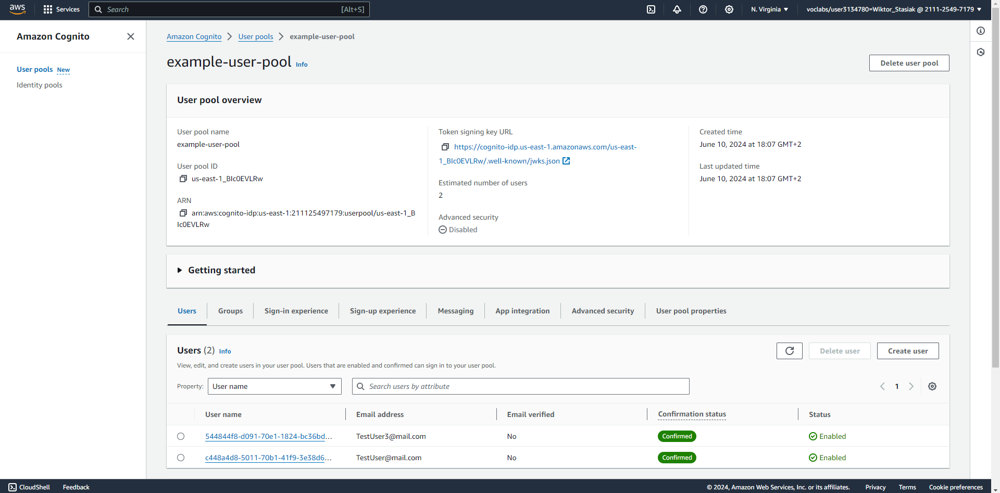
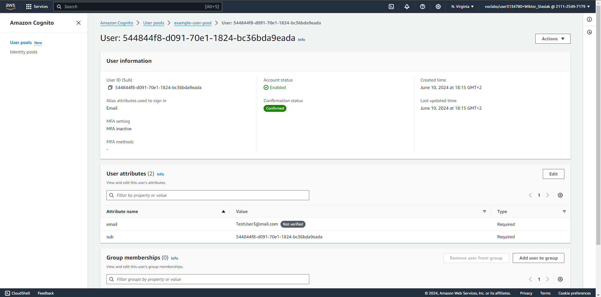
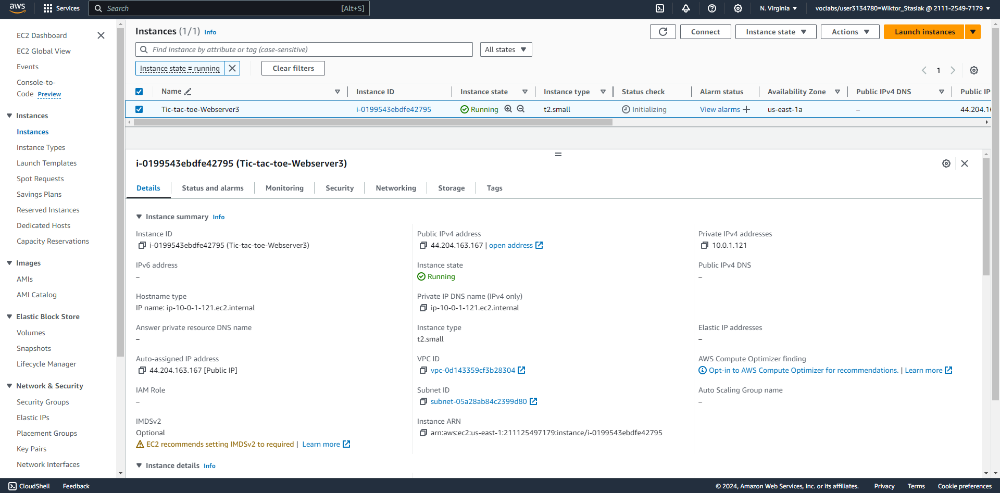
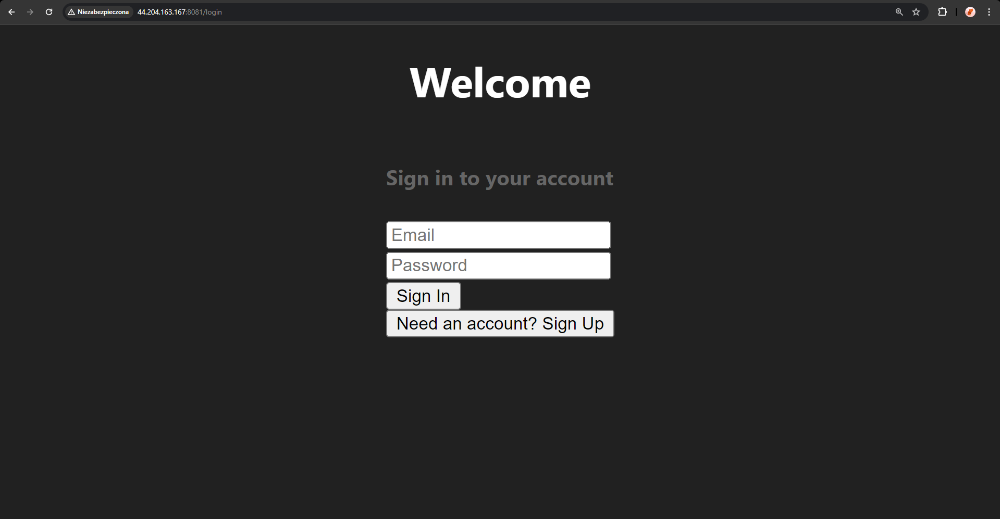
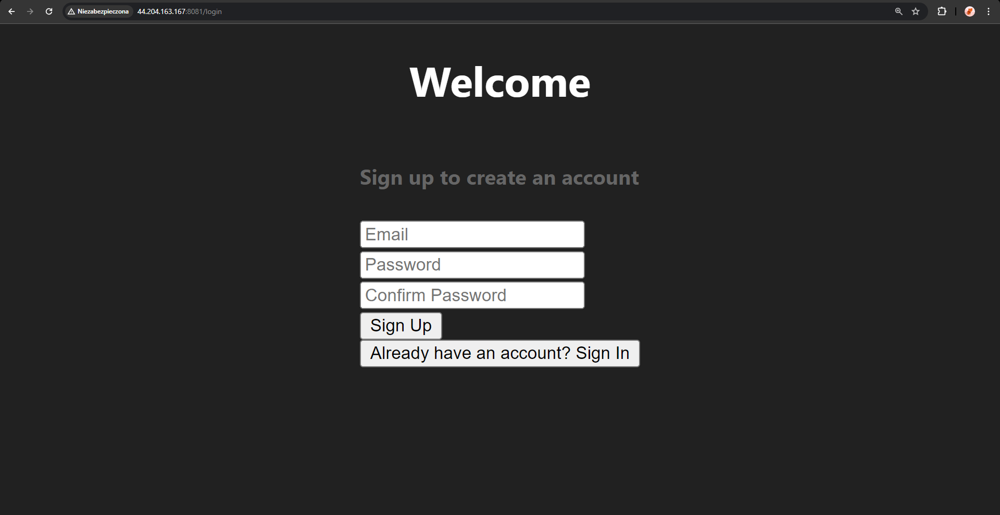
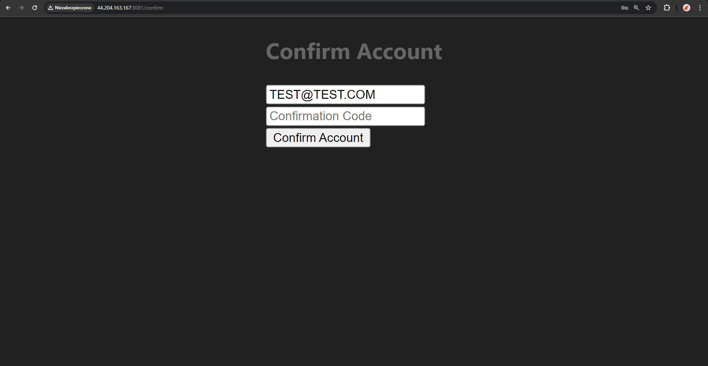
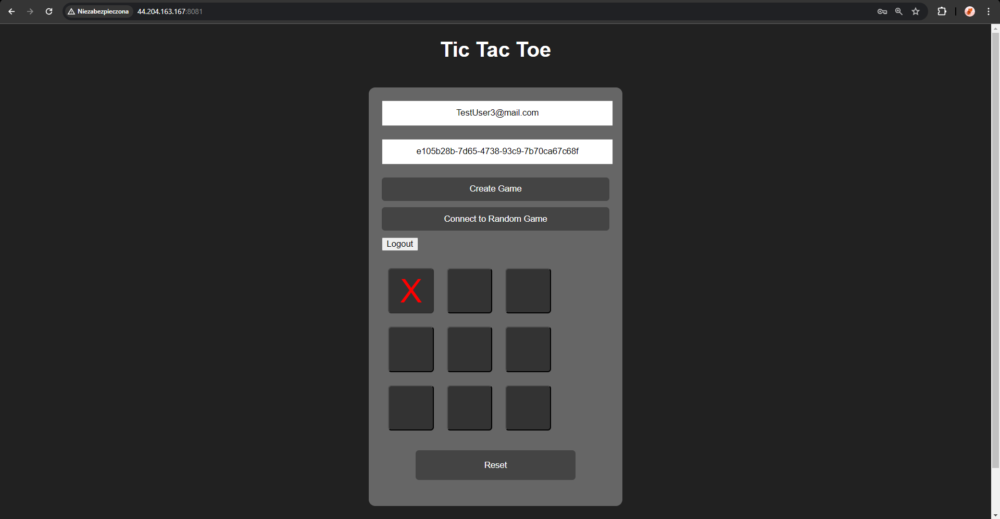

# Katarzyna Wysokińska - AWS Cognito Report

- Course: _Cloud Programming_
- Group: W04IST-SI4527G
- Date: June 13, 2024

## Environment Architecture

### AWS Resources Created:

- **AWS Cognito User Pool**
- **EC2 Instance**
- **VPC and Networking Components**: VPC, Subnet, Internet Gateway, Route Table, Route Table Association, Security Group

## Preview

### AWS Cognito User Pool Configuration:

### EC2 Instance:

### Running App:

  
  

### Configured AWS Services

#### AWS Cognito

AWS Cognito was configured to handle user authentication for the application. The main components include:

1. **User Pool**: `Tic-Tac-Toe-user-pool`

   - **Username Attributes**: Email
   - **Auto-verified Attributes**: Email
   - **Password Policy**: Minimum length of 8, requiring uppercase, lowercase, and numbers.
   - **Verification Message Template**: Email verification with a code.
   - **Admin Create User Config**: Allows users to sign up themselves without admin intervention.
   - **Schema**: Email attribute is required and mutable.

2. **User Pool Client**: `example-user-pool-client`
   - **Authentication Flows**: Allows user password authentication and refresh token authentication.
   - **Refresh Token Validity**: 90 days
   - **Prevent User Existence Errors**: Enabled to prevent user enumeration attacks.

#### EC2 Instance

An EC2 instance was created to host the backend and frontend of the Tic-Tac-Toe application. The instance configuration includes:

- **AMI**: Ubuntu 20.04
- **Instance Type**: t2.small
- **Key Pair**: `vockey`
- **Security Group**: Allows SSH, HTTP, and custom TicTacToe ports.
- **User Data Script**: Automates the installation of necessary software, cloning the repository, building the project, and updating configuration files with the appropriate IP addresses and Cognito details.

## Reflections

### What did you learn?

Through this project, I gained hands-on experience with AWS Cognito and Terraform. Specifically, I learned how to configure user authentication and integrate it with an application. Additionally, I learned about setting up and automating deployments on EC2 instances using bash scripts.

### What obstacles did you overcome?

One of the main challenges I encountered was ensuring the correct integration of AWS Cognito with the application. Initially, the user authentication was not working correctly due to misconfigured settings in the Cognito user pool and user pool client.

### What helped most in overcoming obstacles?

To overcome the integration issues, I referred to the AWS documentation and debugged the authentication flow step-by-step. Additionally, using the AWS CLI helped me quickly test and verify the configurations, which sped up the troubleshooting process.

### Was there something that surprised you?

I was surprised by the complexity and depth of AWS Cognito's configuration options. While the service provides powerful features for user management and authentication, ensuring that all settings are correctly configured to match the application's requirements can be intricate.
