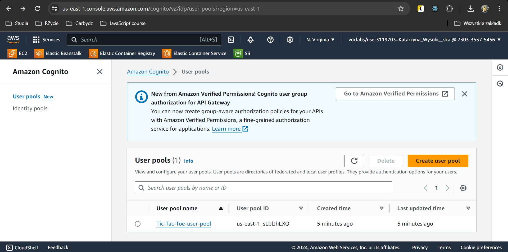
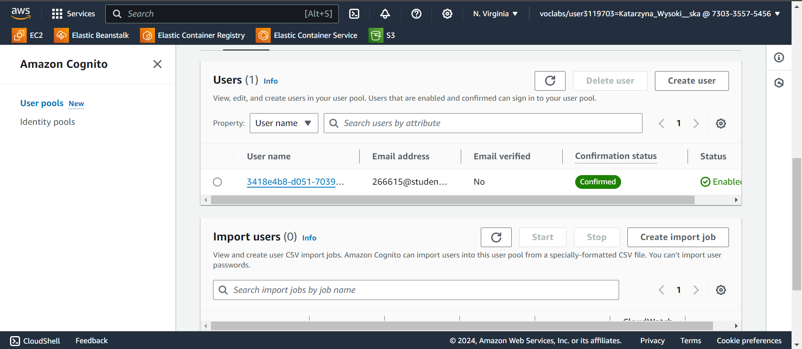
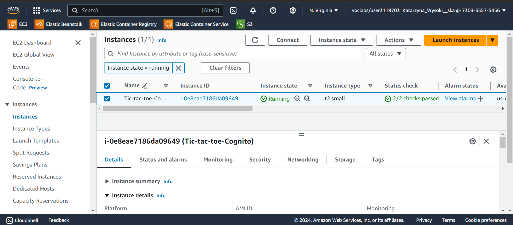

# Katarzyna Wysokińska - AWS Cognito Report

- Course: _Cloud Programming_
- Group: W04IST-SI4527G
- Date: June 13, 2024

### AWS Resources Created:

- **AWS Cognito User Pool**
- **EC2 Instance**
- **VPC and Networking Components**: VPC, Subnet, Internet Gateway, Route Table, Route Table Association, Security Group

## Preview

### AWS Cognito User Pool Configuration:

### EC2 Instance:

### Running App:

### Configured AWS Services

#### AWS Cognito

AWS Cognito was configured to handle user authentication for the application. The main components include:

1. **User Pool**: `Tic-Tac-Toe-user-pool`

   - **Username Attributes**: Email
   - **Auto-verified Attributes**: Email
   - **Password Policy**: Minimum length of 8, requiring uppercase, lowercase, and numbers.
   - **Verification Message Template**: Email verification with a code.
   - **Admin Create User Config**: Allows users to sign up themselves without admin intervention.
   - **Schema**: Email attribute is required and mutable.

2. **User Pool Client**: `example-user-pool-client`
   - **Authentication Flows**: Allows user password authentication and refresh token authentication.
   - **Refresh Token Validity**: 90 days
   - **Prevent User Existence Errors**: Enabled to prevent user enumeration attacks.

#### EC2 Instance

An EC2 instance was created to host the backend and frontend of the Tic-Tac-Toe application. The instance configuration includes:

- **AMI**: Ubuntu 20.04
- **Instance Type**: t2.small
- **Key Pair**: `vockey`
- **Security Group**: Allows SSH, HTTP, and custom TicTacToe ports.
- **User Data Script**: Automates the installation of necessary software, cloning the repository, building the project, and updating configuration files with the appropriate IP addresses and Cognito details.

## Reflections

### What did you learn?

Through this project, I gained hands-on experience with AWS Cognito and Terraform. Specifically, I learned how to configure user authentication and integrate it with an application. Additionally, I learned about setting up and automating deployments on EC2 instances using bash scripts.

### What obstacles did you overcome?

#### 1. Integration Issues with AWS Cognito:

One of the primary challenges I faced was ensuring the correct integration of AWS Cognito with the application. Initially, the user authentication flow was failing because the Cognito user pool and user pool client settings were misconfigured.

**Solution**:
I revisited the AWS Cognito settings and ensured that the user pool's `username_attributes` and `auto_verified_attributes` were set correctly to `email`. I also verified that the `explicit_auth_flows` in the user pool client included `ALLOW_USER_PASSWORD_AUTH` and `ALLOW_REFRESH_TOKEN_AUTH`. To confirm the changes, I used the AWS CLI to manually test the authentication process, which helped identify and resolve the misconfigurations.

#### 2. Email Verification Issues:

Another problem encountered was with the email verification process. Users were not receiving verification emails, which was critical for the sign-up flow.

**Solution**:
I checked the `verification_message_template` configuration in the user pool settings and ensured that it was set to `CONFIRM_WITH_CODE`. Additionally, I verified that SES (Simple Email Service) was properly configured and that there were no restrictions on sending emails from the configured domain. This troubleshooting step resolved the issue, allowing users to receive verification emails as expected.

#### 3. Network Configuration Problems:

Initially, the application hosted on the EC2 instance could not be accessed from the internet due to incorrect network configurations.

**Solution**:
I ensured that the EC2 instance was associated with a public subnet and had a public IP address. Additionally, I verified the security group settings to allow inbound traffic on the required ports (22 for SSH, 8080, and 8081 for the application). I also checked the route table associated with the subnet to ensure it had a route to the internet via the internet gateway.

#### 4. Updating Configuration Files with Dynamic Values:

The final challenge was updating the configuration files dynamically during the EC2 instance initialization, particularly for the IP address and AWS Cognito details.

**Solution**:
I used a bash script in the EC2 user data to fetch the instance's public IP address using the EC2 metadata service. This script also updated the `config.json` file with the region, user pool ID, and client ID dynamically by using Terraform's interpolation syntax. This automation ensured that the correct values were always set during instance launch.

### What helped most in overcoming obstacles?

To overcome the integration issues, I relied heavily on the AWS documentation and online forums for specific error messages and configuration tips. Debugging the authentication flow step-by-step using AWS CLI and Cognito debugging tools also proved invaluable. For network issues, VPC flow logs and security group logs provided critical insights into traffic and connection problems.

### Was there something that surprised you?

I was surprised by the complexity and depth of AWS Cognito's configuration options. While the service provides powerful features for user management and authentication, ensuring that all settings are correctly configured to match the application's requirements can be intricate. Additionally, the seamless integration of Terraform with AWS services to automate infrastructure provisioning was impressive, though it required careful attention to detail to avoid configuration errors.
